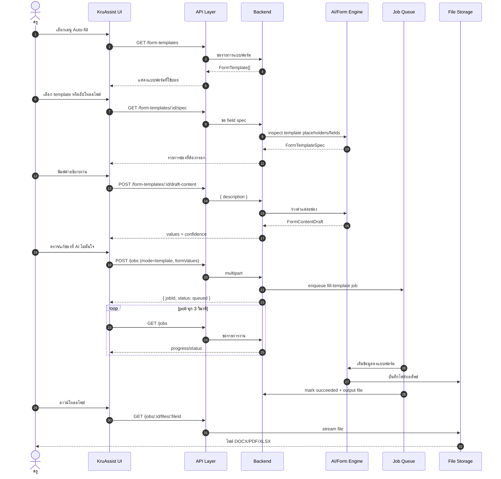
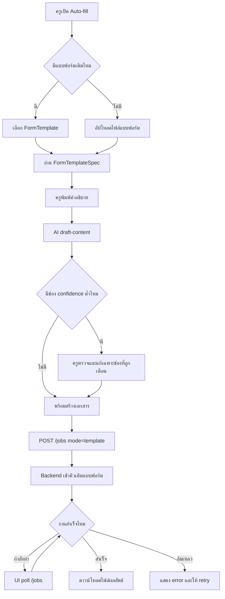
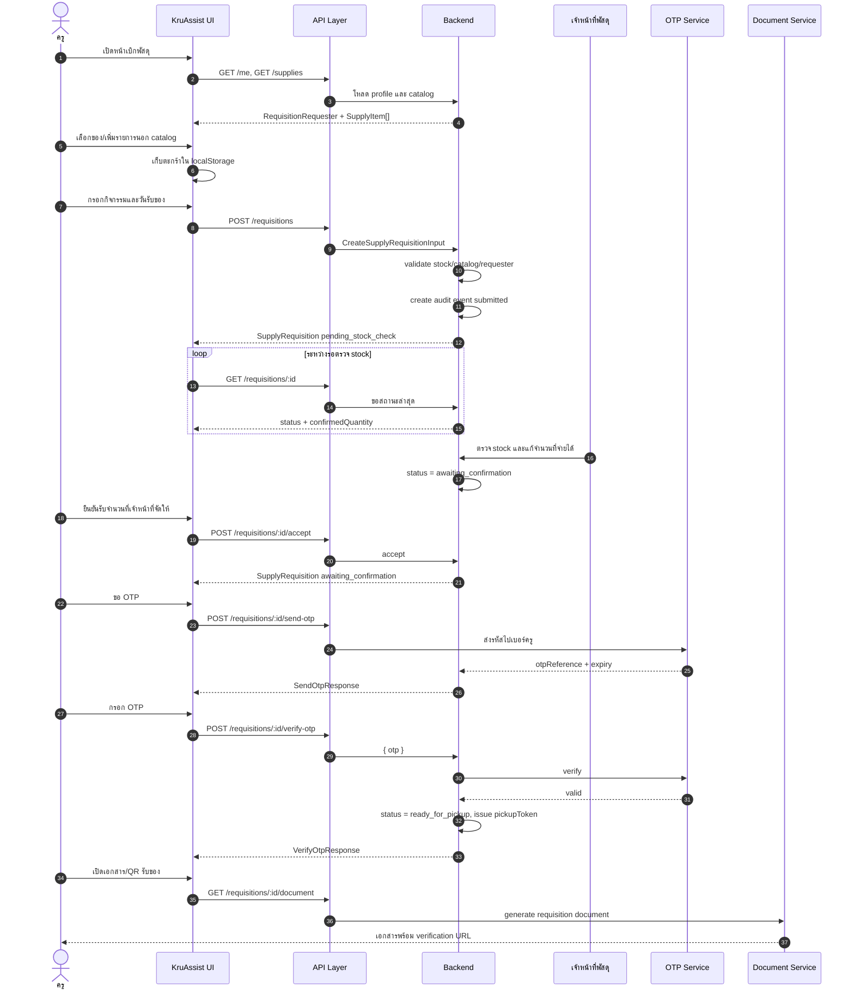
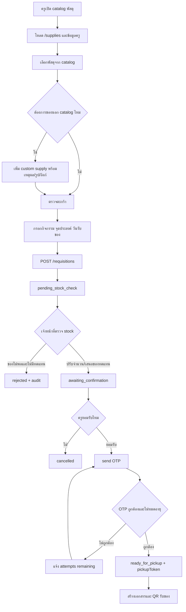
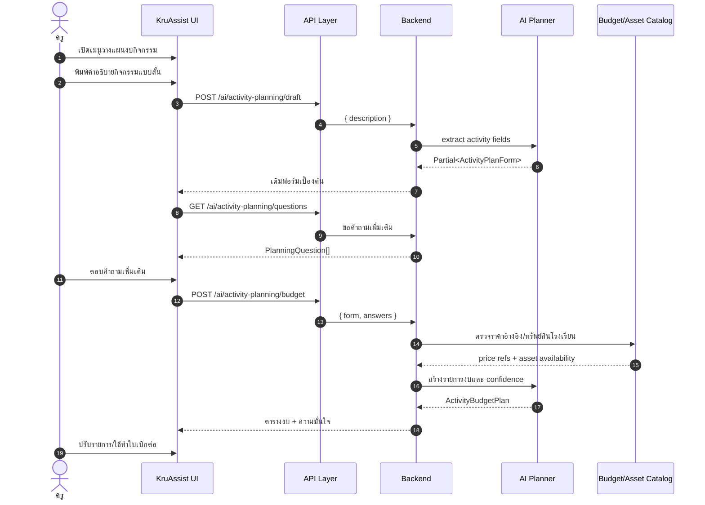
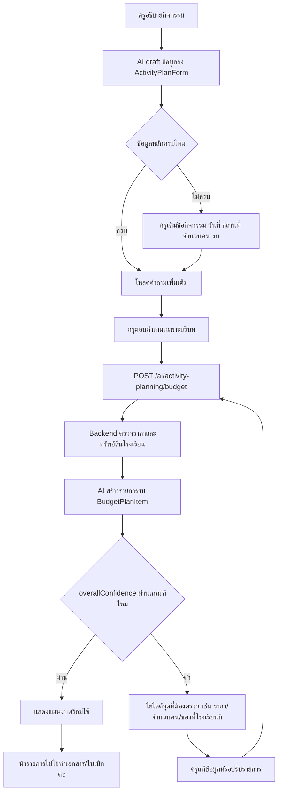

# KruAssist — สถาปัตยกรรมระบบและสัญญา API

เอกสารฉบับเทคนิค สำหรับคนที่จะมาต่อ backend หรือรับช่วงพัฒนาต่อ
สถานะ ณ ตอนนี้: **frontend เสร็จครบทุก flow และทำงานได้จริงบน mock — ยังไม่ได้ต่อ backend จริง**

---

## 1. ภาพรวมระบบ

```
┌───────────────────────────────────────────────────────────────────┐
│                         หน้าจอที่ผู้ใช้เห็น                          │
│                                                                   │
│   index.html                        line-demo.html                │
│   ระบบเว็บ (คอม/มือถือ)              Prototype จำลอง LINE OA        │
│   ├─ ส่งเอกสารให้ AI / Auto-fill      ├─ Rich Menu 2 แท็บ            │
│   ├─ เบิกงบ / เบิกพัสดุ               ├─ หน้าแชท + Flex Message      │
│   └─ วางแผนงบกิจกรรม                  └─ LIFF 12 หน้าจอ             │
└─────────────────────┬─────────────────────┬───────────────────────┘
                      │                     │
                      ▼                     ▼
        ┌──────────────────────────────────────────────┐
        │   React Hooks (TanStack Query)               │
        │   useJobs · useCreateJob · useProfile        │
        │   useCatalog · useRequisitions · useAiAssist │
        │   useSupplyRequisition · useActivityPlanning │
        │   — จัดการ cache / retry / polling ให้        │
        └──────────────────┬───────────────────────────┘
                           ▼
        ┌──────────────────────────────────────────────┐
        │   API Layer  (src/api/*.api.ts)              │
        │   จุดเดียวในระบบที่รู้จัก backend               │
        │                                              │
        │   if (env.useMock) → mock server (ในเบราว์เซอร์)│
        │   else             → http เรียก backend จริง   │
        └──────────────────┬───────────────────────────┘
                           ▼
        ┌──────────────────────────────────────────────┐
        │   http.ts — HTTP client กลาง                  │
        │   timeout · แนบ token · upload progress       │
        │   แปลง error เป็นข้อความไทย                    │
        └──────────────────┬───────────────────────────┘
                           ▼
                  ยังไม่มี ← [ Backend จริง ]
```

**หลักการเดียวที่ต้องจำ:** ไม่มีไฟล์ UI ไฟล์ไหนรู้จัก URL ของ backend เลย
ทุกอย่างผ่าน `src/api/` ชั้นเดียว เวลาต่อของจริงจึงแก้ที่เดียว

---

## 2. โครงสร้างโฟลเดอร์และหน้าที่

| โฟลเดอร์               | หน้าที่                          | แก้เมื่อไร                        |
| ---------------------- | -------------------------------- | --------------------------------- |
| `src/types/`           | โดเมนกลางของทั้งระบบ             | เพิ่ม/แก้ field ของข้อมูล         |
| `src/api/endpoints.ts` | รวม path ของ API ทุกตัว          | backend เปลี่ยน path              |
| `src/api/http.ts`      | HTTP client กลาง                 | เปลี่ยนวิธี auth / error handling |
| `src/api/*.api.ts`     | สลับ mock ↔ ของจริง + แปลงข้อมูล | ชื่อ field ฝั่ง backend ไม่ตรง    |
| `src/api/mock/`        | backend จำลองในหน่วยความจำ       | ลบทิ้งได้เมื่อต่อของจริงเสร็จ     |
| `src/hooks/`           | ครอบ API ด้วย TanStack Query     | เปลี่ยนกลยุทธ์ cache / polling    |
| `src/features/`        | UI แยกตามฟีเจอร์                 | งาน UI                            |
| `src/line-demo/`       | Prototype LINE (แยกจากระบบจริง)  | งาน demo/นำเสนอ                   |
| `src/config/env.ts`    | อ่าน env ที่เดียว                | เพิ่มตัวแปรตั้งค่า                |

---

## 3. โดเมนหลัก (`src/types/index.ts`)

```
TeacherProfile   ครูที่ล็อกอินอยู่
      │
      ├── Job                 งานที่ส่งให้ AI ทำ
      │    ├── mode           template | ocr | accounting
      │    ├── status         queued | processing | succeeded | failed
      │    ├── progress       0-100 + progressMessage
      │    ├── formTemplateId ─────► FormTemplate  (โหมดเติมแบบฟอร์ม)
      │    ├── projectId      ─────► Project       (โหมดทำบัญชี)
      │    ├── receiptCategory─────► ReceiptCategory
      │    └── outputs[]      ─────► JobOutputFile (ไฟล์ผลลัพธ์)
      │
      └── Requisition         ใบเบิกงบ / ยืมพัสดุ
           ├── kind           budget | borrow
           ├── status         draft | pending | approved | returned
           ├── projectId      ─────► Project
           ├── approverId     ─────► Approver
           └── items[]        ─────► RequisitionItem

TeacherProfile
      │
      ├── SupplyRequisition   คำขอเบิกพัสดุฝั่งครู (`src/types/supply.ts`)
      │    ├── status         pending_stock_check | awaiting_confirmation | ready_for_pickup | ...
      │    ├── publicToken    ใช้เปิดหน้าติดตาม/เอกสาร/รับของ
      │    ├── items[]        catalog item หรือ custom item
      │    ├── auditEvents[]  ประวัติทุก action ของครู/เจ้าหน้าที่/ระบบ
      │    └── document       เอกสารเบิกพัสดุพร้อม verification URL
      │
      └── ActivityBudgetPlan  แผนงบกิจกรรมที่ AI ช่วยร่าง
           ├── items[]        รายการงบ + จำนวน + ราคาอ้างอิง + ผู้รับผิดชอบ
           ├── confidence     coverage | people | prices | assets
           └── ready          พร้อมใช้ทำเอกสารต่อหรือยัง
```

**ชนิดข้อมูลของฝั่ง AI** (ใช้กับทุก endpoint ที่ขึ้นต้นด้วย `/ai/`)

```ts
type Confidence = 'high' | 'low';

interface DraftField<T> {
  value: T;
  confidence: Confidence;
  reason?: string; // เหตุผลว่าเดามาจากอะไร — UI เอาไปโชว์ให้ครูตัดสินใจ
}

interface DraftSummary {
  confidentCount: number; // ใช้ขึ้นป้าย "4/5 ชัดเจน"
  totalCount: number;
}
```

> ทำไมต้องมี `confidence` + `reason`: UI จะไฮไลต์เฉพาะช่องที่ AI ไม่มั่นใจเป็นสีส้ม
> ครูจึงตรวจเฉพาะจุดแทนที่จะไล่ตรวจทุกช่อง **ถ้า backend ไม่ส่ง 2 ค่านี้มา ฟีเจอร์นี้จะใช้ไม่ได้**

---

## 4. สัญญา API ที่ frontend คาดหวัง

Base URL มาจาก `VITE_API_BASE_URL` (ถ้าไม่ตั้ง จะ fallback เป็น `/api`)

### 4.1 ผู้ใช้

| Method | Path  | Response         |
| ------ | ----- | ---------------- |
| `GET`  | `/me` | `TeacherProfile` |

### 4.2 งานที่ส่งให้ AI

| Method | Path                      | Body                       | Response                               |
| ------ | ------------------------- | -------------------------- | -------------------------------------- |
| `GET`  | `/jobs`                   | —                          | `Job[]`                                |
| `GET`  | `/jobs/:id`               | —                          | `Job`                                  |
| `POST` | `/jobs`                   | **multipart** (ดูด้านล่าง) | `{ jobId, status, estimatedSeconds? }` |
| `POST` | `/jobs/:id/retry`         | —                          | `Job`                                  |
| `POST` | `/jobs/:id/cancel`        | —                          | `204`                                  |
| `GET`  | `/jobs/:id/files/:fileId` | —                          | ไฟล์ binary                            |

**multipart ของ `POST /jobs`**

| field             | ชนิด        | บังคับ | หมายเหตุ                                      |
| ----------------- | ----------- | ------ | --------------------------------------------- |
| `mode`            | string      | ✓      | `template` \| `ocr` \| `accounting`           |
| `files`           | file[]      | —      | ว่างได้ ถ้าใช้ `formTemplateId`               |
| `notes`           | string      | —      | คำสั่งเพิ่มเติมถึง AI                         |
| `formTemplateId`  | string      | —      | ใช้แบบฟอร์มที่เคยอัปโหลดแทนการส่งไฟล์ใหม่     |
| `formValues`      | JSON string | —      | โหมด Auto-fill: ค่าที่จะกรอกลงช่องของแบบฟอร์ม |
| `projectId`       | string      | —      | โหมดบัญชี                                     |
| `receiptCategory` | string      | —      | โหมดบัญชี                                     |

> **สำคัญ:** frontend อัปโหลดด้วย `XMLHttpRequest` เพื่ออ่าน progress
> backend จึงต้องรับ multipart ปกติ และ**ตอบกลับทันทีโดยไม่รอ AI ทำเสร็จ**
> (เป็นแบบ async job — client จะ poll เอาสถานะเอง)

### 4.3 ข้อมูลตั้งต้น

| Method | Path                                | Body              | Response                                           |
| ------ | ----------------------------------- | ----------------- | -------------------------------------------------- |
| `GET`  | `/form-templates`                   | —                 | `FormTemplate[]` — เรียงตาม `usageCount` มาก→น้อย  |
| `GET`  | `/form-templates/:id/spec`          | —                 | `FormTemplateSpec` — รายการช่องที่แบบฟอร์มต้องกรอก |
| `POST` | `/form-templates/:id/draft-content` | `{ description }` | `FormContentDraft` — AI ร่างค่าลงช่องจากคำอธิบาย   |
| `GET`  | `/projects`                         | —                 | `Project[]` — เฉพาะ `active: true`                 |
| `GET`  | `/requisitions/approvers`           | —                 | `Approver[]`                                       |

> `ReceiptCategory` เป็นค่าคงที่ฝั่ง frontend (`getReceiptCategories()`)
> ถ้าอยากให้โรงเรียนกำหนดเอง ให้เปลี่ยนฟังก์ชันนั้นไปเรียก API แทน — จุดเดียว

### 4.4 ใบเบิกงบ / ยืมพัสดุ

| Method | Path                          | Body                     | Response                                     |
| ------ | ----------------------------- | ------------------------ | -------------------------------------------- |
| `GET`  | `/requisitions`               | —                        | `Requisition[]`                              |
| `POST` | `/requisitions`               | `CreateRequisitionInput` | `Requisition` (ต้องมี `docNo` ที่ออกให้แล้ว) |
| `POST` | `/requisitions/suggest-items` | `{ description }`        | `SuggestedItem[]`                            |

### 4.5 AI ช่วยร่าง ⭐ ส่วนที่ต้องมีโมเดลภาษา

| Method | Path                    | Body                  | Response            |
| ------ | ----------------------- | --------------------- | ------------------- |
| `POST` | `/ai/draft-requisition` | `{ description }`     | `RequisitionDraft`  |
| `POST` | `/ai/detect-document`   | **multipart** `files` | `DocumentDetection` |
| `GET`  | `/ai/daily-summary`     | —                     | `DailySummary`      |
| `POST` | `/ai/portfolio-caption` | `{ text }`            | `{ caption }`       |

**`RequisitionDraft`** — จากประโยคเดียวที่ครูพิมพ์ ต้องเดาให้ครบ

```ts
{
  kind:       DraftField<'budget' | 'borrow'>,
  purpose:    DraftField<string>,   // เรียบเรียงเป็นภาษาราชการแล้ว
  projectId:  DraftField<string>,
  neededBy:   DraftField<string>,   // "18 ส.ค. 2569"
  approverId: DraftField<string>,   // เลือกตามวงเงินตามระเบียบพัสดุ
  items:      Omit<RequisitionItem, 'id'>[],
  summary:    DraftSummary,
}
```

**`DocumentDetection`** — จากไฟล์ที่ครูแนบ

```ts
{
  mode:            DraftField<DocumentMode>,
  projectId?:      DraftField<string>,
  receiptCategory?: DraftField<ReceiptCategoryId>,
  vendor?:         DraftField<string>,
  totalAmount?:    DraftField<number>,
  issuedDate?:     DraftField<string>,
  vatAmount?:      number,          // คำนวณให้เลย ครูไม่ต้องกดเครื่องคิดเลข
  summary:         DraftSummary,
}
```

### 4.6 Auto-fill แบบฟอร์ม

Auto-fill คือ flow ที่ครูเลือกแบบฟอร์มเดิมหรืออัปโหลดไฟล์ แล้วให้ AI ช่วยเติมช่องต่าง ๆ ก่อนส่งเป็นงาน `mode = template`

| Method | Path                                | Body                                                                                | Response                               |
| ------ | ----------------------------------- | ----------------------------------------------------------------------------------- | -------------------------------------- |
| `GET`  | `/form-templates`                   | —                                                                                   | `FormTemplate[]`                       |
| `GET`  | `/form-templates/:id/spec`          | —                                                                                   | `FormTemplateSpec`                     |
| `POST` | `/form-templates/:id/draft-content` | `{ description }`                                                                   | `FormContentDraft`                     |
| `POST` | `/jobs`                             | **multipart** `mode=template`, `formTemplateId?`, `files?`, `formValues?`, `notes?` | `{ jobId, status, estimatedSeconds? }` |
| `GET`  | `/jobs`                             | —                                                                                   | `Job[]` สำหรับ poll progress           |
| `GET`  | `/jobs/:id/files/:fileId`           | —                                                                                   | ไฟล์ผลลัพธ์                            |

**`FormTemplateSpec`**

```ts
{
  templateId: string,
  templateName: string,
  fields: {
    id: string,
    label: string,
    required: boolean,
    hint?: string,
    multiline?: boolean,
  }[],
}
```

**`FormContentDraft`**

```ts
{
  values: Record<string, DraftField<string>>,
  summary: DraftSummary,
}
```

**Backend design ที่ต้องรองรับ**

- ต้องมีตัวอ่าน template เพื่อแปลง DOCX/PDF/XLSX เป็น field spec ที่ stable (`field.id` ห้ามเปลี่ยนทุกครั้งที่ inspect)
- ต้องเก็บ mapping ระหว่าง `templateId` กับ field positions/placeholders เพื่อให้ `POST /jobs` เติมไฟล์ได้ถูกตำแหน่ง
- `draft-content` ควรคืนค่าเฉพาะ field ที่เดาได้ และใส่ `confidence/reason` ทุกช่อง เพื่อให้ UI ไฮไลต์ช่องที่ต้องตรวจ
- `POST /jobs` ต้องรับ `formValues` เป็น JSON string ใน multipart แล้วสร้าง output เป็นไฟล์ที่ดาวน์โหลดได้ผ่าน `/jobs/:id/files/:fileId`

### 4.7 เบิกพัสดุ

ฟีเจอร์นี้เป็นโดเมนใหม่ใน `src/types/supply.ts` แยกจาก `Requisition` เดิมที่ใช้กับใบเบิกงบ/ยืมพัสดุทั่วไป

> สถานะปัจจุบันใน `src/api/endpoints.ts`: supply requisition ยังใช้ path กลุ่ม `/requisitions*`
> ร่วมกับ flow ใบเบิกงบเดิม ถ้าจะต่อ backend จริงและใช้ 2 flow พร้อมกัน แนะนำให้แยก namespace เป็น
> `/supply-requisitions*` แล้วแก้ที่ `endpoints.ts` จุดเดียวก่อน production เพื่อลด schema collision

| Method | Path ที่ frontend เรียกตอนนี้       | Body                           | Response                  |
| ------ | ----------------------------------- | ------------------------------ | ------------------------- |
| `GET`  | `/supplies`                         | —                              | `SupplyItem[]`            |
| `POST` | `/requisitions`                     | `CreateSupplyRequisitionInput` | `SupplyRequisition`       |
| `GET`  | `/requisitions/mine`                | —                              | `SupplyRequisition[]`     |
| `GET`  | `/requisitions/:id`                 | —                              | `SupplyRequisition`       |
| `POST` | `/requisitions/:id/cancel`          | —                              | `SupplyRequisition`       |
| `POST` | `/requisitions/:id/accept`          | —                              | `SupplyRequisition`       |
| `POST` | `/requisitions/:id/send-otp`        | —                              | `SendOtpResponse`         |
| `POST` | `/requisitions/:id/verify-otp`      | `{ otp }`                      | `VerifyOtpResponse`       |
| `GET`  | `/requisitions/:id/audit-events`    | —                              | `RequisitionAuditEvent[]` |
| `GET`  | `/requisitions/:id/document`        | —                              | `RequisitionDocument`     |
| `GET`  | `/requisitions/:id/document/verify` | —                              | `DocumentVerification`    |

**สถานะหลักของคำขอเบิกพัสดุ**

```ts
type SupplyRequisitionStatus =
  | 'draft'
  | 'pending_stock_check'
  | 'awaiting_confirmation'
  | 'ready_for_pickup'
  | 'rejected'
  | 'cancelled'
  | 'expired';
```

**Backend design ที่ต้องรองรับ**

- Catalog ต้องแยก `availabilityLabel` (`available | low | paused`) จากจำนวน stock จริง เพื่อไม่เผยตัวเลขที่ไม่จำเป็นให้ครู
- ตะกร้าอยู่ฝั่ง browser (`localStorage`) จนกดส่งคำขอ backend จึงต้อง validate ซ้ำทุก item ตอน `POST /requisitions`
- เจ้าหน้าที่ต้องมี service หรือ back office สำหรับตรวจ stock แล้วเปลี่ยนสถานะเป็น `awaiting_confirmation` หรือ `rejected`
- ทุกการเปลี่ยนสถานะต้องสร้าง `auditEvents` เพื่อใช้แสดง timeline และใช้ตรวจย้อนหลัง
- OTP ต้องมีอายุ, จำกัดจำนวนครั้ง, มี `otpReference`, และเมื่อ verify สำเร็จต้องออก `pickupToken`/QR สำหรับรับของ
- `document` ต้องสร้างแบบ deterministic ตาม version/template เดียวกัน และมี `verificationNumber` + `verificationUrl`

### 4.8 วางแผนงบกิจกรรม

Flow นี้ใช้ AI ช่วย 3 จังหวะ: เดาข้อมูลกิจกรรมจากคำอธิบาย, ถามคำถามเพิ่ม, แล้วสร้างตารางงบประมาณ

| Method | Path                              | Body                | Response                    |
| ------ | --------------------------------- | ------------------- | --------------------------- |
| `POST` | `/ai/activity-planning/draft`     | `{ description }`   | `Partial<ActivityPlanForm>` |
| `GET`  | `/ai/activity-planning/questions` | —                   | `PlanningQuestion[]`        |
| `POST` | `/ai/activity-planning/budget`    | `{ form, answers }` | `ActivityBudgetPlan`        |

**`ActivityPlanForm`**

```ts
{
  eventName: string,
  objective: string,
  eventDate: string,
  venue: string,
  durationHours: string,
  students: string,
  parents: string,
  teachers: string,
  guests: string,
  budget: string,
  agenda: string,
}
```

**`ActivityBudgetPlan`**

```ts
{
  items: {
    availability: 'โรงเรียนไม่มี' | 'อาจจะมี' | 'มีแน่นอน',
    item: string,
    quantity: string,
    reference: string,
    amount: number,
    source: string,
    owner: string,
  }[],
  confidence: {
    coverage: number,
    people: number,
    prices: number,
    assets: number,
  },
  overallConfidence: number,
  ready: boolean,
}
```

**Backend design ที่ต้องรองรับ**

- `draft` ต้องคืนแค่ field ที่เดาได้จากประโยคเดียว ไม่ควร fabricate ข้อมูลสำคัญ เช่น วันที่หรือจำนวนคน
- `questions` ควรเป็น school-configurable เพราะแต่ละโรงเรียนต้องถามข้อมูลไม่เหมือนกัน เช่น รถรับส่ง/อาหาร/วิทยากร
- `budget` ต้องตรวจวงเงินกับ `Project.budgetTotal/budgetUsed` ได้ในอนาคต และควรใส่ `source` ของราคาอ้างอิงทุก item
- `confidence.assets` ควรอิง asset catalog ของโรงเรียน ไม่ใช่เดาจาก LLM ล้วน

### 4.9 Sequence Diagram และ Flowchart ของ 3 workflow

#### 4.9.1 Auto-fill — Sequence Diagram



#### 4.9.2 Auto-fill — Flowchart



#### 4.9.3 เบิกพัสดุ — Sequence Diagram



#### 4.9.4 เบิกพัสดุ — Flowchart



#### 4.9.5 วางแผนงบกิจกรรม — Sequence Diagram



#### 4.9.6 วางแผนงบกิจกรรม — Flowchart



---

## 5. ข้อตกลงระดับ HTTP (`src/api/http.ts`)

| เรื่อง       | ที่ตกลงไว้                                                                                                   |
| ------------ | ------------------------------------------------------------------------------------------------------------ |
| **Auth**     | `Authorization: Bearer <token>` อ่านจาก `localStorage['auth_token']`<br>ยังไม่มีหน้า login — **ต้องทำเพิ่ม** |
| **Response** | รับทั้งแบบส่งตรง และแบบห่อ `{ "data": ... }` (unwrap ให้เอง)                                                 |
| **Error**    | อ่าน `{ code, message }` จาก body ถ้ามี แล้วโยนเป็น `ApiError`                                               |
| **Timeout**  | 30 วินาที (`VITE_API_TIMEOUT_MS`)                                                                            |
| **Retry**    | 4xx ไม่ retry · 5xx/network retry 2 ครั้ง (ตั้งที่ `QueryProvider`)                                          |
| **Upload**   | ใช้ `XMLHttpRequest` เพื่ออ่าน progress                                                                      |

**การแปลง HTTP status เป็นข้อความไทย** — backend ควรใช้ status ให้ตรงความหมาย เพราะ frontend แปลงเป็นข้อความให้ครูอ่านโดยอัตโนมัติ

| Status        | ข้อความที่ครูเห็น                              |
| ------------- | ---------------------------------------------- |
| `0` (network) | เชื่อมต่ออินเทอร์เน็ตไม่ได้ กรุณาตรวจสอบสัญญาณ |
| `401 / 403`   | เซสชันหมดอายุ กรุณาเข้าสู่ระบบใหม่             |
| `404`         | ไม่พบข้อมูลที่ต้องการ อาจถูกลบไปแล้ว           |
| `408`         | ระบบใช้เวลานานเกินไป                           |
| `413`         | ไฟล์มีขนาดใหญ่เกินกำหนด                        |
| `429`         | มีการใช้งานหนาแน่น กรุณารอสักครู่              |
| `5xx`         | ระบบขัดข้องชั่วคราว ติดต่อฝ่ายไอที             |

---

## 6. Polling ของสถานะงาน

```
useJobs()
  └─ refetchInterval: มีงาน processing/queued อยู่ไหม?
       ├─ มี   → ถามซ้ำทุก 3 วินาที (VITE_JOB_POLL_INTERVAL_MS)
       └─ ไม่มี → หยุดถามเอง
```

ประหยัด request และครูไม่ต้องกดรีเฟรชเอง
ถ้า backend รองรับ WebSocket/SSE ในอนาคต ให้เปลี่ยนที่ `src/hooks/useJobs.ts` จุดเดียว

---

## 7. การตั้งค่า (`.env`)

| ตัวแปร                      | ค่าเริ่มต้น   | ใช้ทำอะไร                                      |
| --------------------------- | ------------- | ---------------------------------------------- |
| `VITE_API_BASE_URL`         | _(ว่าง)_      | URL ของ backend — **ว่าง = ใช้ mock ทั้งหมด**  |
| `VITE_USE_MOCK`             | auto          | บังคับเปิด/ปิด mock (`false` = ยิงของจริง)     |
| `VITE_API_TIMEOUT_MS`       | `30000`       | timeout ของ request                            |
| `VITE_JOB_POLL_INTERVAL_MS` | `3000`        | ความถี่ถามสถานะงาน                             |
| `VITE_MAX_FILE_SIZE_MB`     | `25`          | ขนาดไฟล์สูงสุด — **ต้องตั้งให้ตรงกับ backend** |
| `VITE_MAX_FILE_COUNT`       | `10`          | จำนวนไฟล์สูงสุดต่อครั้ง                        |
| `VITE_SUPPORT_PHONE`        | `02-123-4567` | เบอร์ฝ่ายไอทีในกล่องช่วยเหลือ                  |

---

## 8. ขั้นตอนต่อ backend จริง

1. `cp .env.example .env` แล้วตั้ง `VITE_API_BASE_URL` + `VITE_USE_MOCK=false`
2. ถ้าชื่อ field ไม่ตรงกับ `src/types/` หรือ `src/types/supply.ts` → แก้/เพิ่มตัว normalize ในไฟล์
   `*.api.ts` **เท่านั้น** ไม่ต้องแตะ UI
3. ทำหน้า login แล้วเก็บ token ลง `localStorage['auth_token']`
   (หรือเปลี่ยนวิธีที่ `authHeaders()` ใน `http.ts` จุดเดียว)
4. ตัดสินใจ namespace ของเบิกพัสดุ (`/requisitions` เดิม หรือ `/supply-requisitions` ใหม่) แล้วแก้
   `src/api/endpoints.ts` ให้ตรงก่อนเริ่ม backend จริง
5. ลบโฟลเดอร์ `src/api/mock/` เมื่อไม่ต้องใช้แล้ว

---

## 9. สิ่งที่ backend ต้องมี (ยังไม่มีเลย)

| ระบบ                          | ทำอะไร                                                  | ความยาก                          |
| ----------------------------- | ------------------------------------------------------- | -------------------------------- |
| **Auth / SSO**                | ล็อกอินครู ออก token                                    | ปานกลาง — ต้องเชื่อมระบบโรงเรียน |
| **Job queue**                 | รับไฟล์ → เข้าคิว → รายงาน progress                     | ปานกลาง                          |
| **OCR**                       | อ่านใบเสร็จภาษาไทย รวมลายมือ                            | **ยาก — ต้องทดสอบความแม่นก่อน**  |
| **LLM**                       | ร่างใบเบิก / Auto-fill / วางแผนงบกิจกรรม / คิดรายการของ | ปานกลาง                          |
| **Template parser/filler**    | อ่านช่องใน DOCX/PDF/XLSX และเติมค่ากลับเป็นไฟล์ผลลัพธ์  | ปานกลาง                          |
| **Supply inventory workflow** | catalog พัสดุ, ตรวจ stock, ยืนยันรายการ, timeline       | ปานกลาง                          |
| **File storage**              | เก็บไฟล์เข้า/ออก                                        | ง่าย                             |
| **e-Signature + OTP**         | ส่ง OTP และผูกลายเซ็นกับเอกสาร                          | **ยาก — มีประเด็นกฎหมาย**        |
| **LINE Messaging API**        | Rich Menu จริง, LIFF, push message                      | ปานกลาง                          |

---

## 9.5 API surface และลำดับทำ backend จริง ⚠️

ตรวจจากโค้ดจริงแล้ว มี endpoint บางตัวที่เป็น legacy และบางตัวถูกใช้โดย flow ใหม่ผ่าน path เดียวกัน
จึงควรตกลง namespace ก่อนเริ่ม backend จริง

### ประกาศใน `endpoints.ts` แต่ไม่มีฟังก์ชันไหนเรียกเลย

| Endpoint                        | สถานะ                             | ควรทำยังไง                                                        |
| ------------------------------- | --------------------------------- | ----------------------------------------------------------------- |
| `GET /form-templates/:id`       | ไม่มีใครเรียก                     | เก็บไว้เผื่อหน้า "จัดการแบบฟอร์ม" ในอนาคต                         |
| `DELETE /form-templates/:id`    | ไม่มีใครเรียก                     | ยังไม่มี UI ให้ลบแบบฟอร์ม                                         |
| `POST /requisitions/:id/submit` | ไม่มีใครเรียกใน flow ใบเบิกงบเดิม | ตอนนี้ `POST /requisitions` สร้างแล้วส่งเลย ไม่มีสถานะ draft จริง |

### Endpoint ที่ path ชนกันระหว่าง flow เดิมกับ flow เบิกพัสดุ

| Path                            | ใช้โดย                        | ความเสี่ยง                                        | ข้อแนะนำ                                                       |
| ------------------------------- | ----------------------------- | ------------------------------------------------- | -------------------------------------------------------------- |
| `POST /requisitions`            | ใบเบิกงบเดิม และเบิกพัสดุใหม่ | request/response schema ไม่เหมือนกัน              | แยก supply เป็น `/supply-requisitions` ก่อนต่อ backend จริง    |
| `GET /requisitions/:id`         | เบิกพัสดุใหม่ใช้ติดตามคำขอ    | ถ้า backend ทำเป็น legacy detail จะคืน schema ผิด | ใช้ namespace แยก หรือ discriminate ด้วย request type ชั่วคราว |
| `POST /requisitions/:id/cancel` | เบิกพัสดุใหม่                 | อาจชนกับ lifecycle ของใบเบิกงบเดิมในอนาคต         | แยก namespace ตั้งแต่ต้นจะง่ายสุด                              |

### มีฟังก์ชันใน API layer แล้ว แต่ยังไม่มี UI เรียก

| ฟังก์ชัน / Hook     | Endpoint                     | สถานะ                                                  |
| ------------------- | ---------------------------- | ------------------------------------------------------ |
| `fetchJob()`        | `GET /jobs/:id`              | ไม่ถูกใช้ — ตอนนี้ใช้ `GET /jobs` แล้ว poll ทั้งชุดแทน |
| `useCancelJob()`    | `POST /jobs/:id/cancel`      | มี hook แล้วแต่ยังไม่มีปุ่มยกเลิกใน UI                 |
| `useWriteCaption()` | `POST /ai/portfolio-caption` | **มี hook แล้วแต่ยังไม่ได้ต่อ** — ดูหมายเหตุด้านล่าง   |

### 🔧 จุดที่ยังไม่ตรงกัน (ควรแก้)

ปุ่ม **"ให้ AI ช่วยเขียนสรุป"** ในหน้า Portfolio ว.PA
(`src/line-demo/screens/PortfolioScreen.tsx`) ยังใช้ `setTimeout` + ข้อความที่ hardcode ไว้
**ไม่ได้เรียก `useWriteCaption()` จริง** ทั้งที่ API layer กับ mock พร้อมแล้ว

> ผลกระทบ: ตอนสาธิตยังดูทำงานปกติ แต่พอต่อ backend จริง ปุ่มนี้จะไม่เรียก API
> ควรเปลี่ยนมาใช้ hook ก่อนส่งมอบ — เป็นงานเล็ก แก้ไฟล์เดียว

### สรุปว่า backend ต้องทำอะไรบ้างจริง ๆ ใน Phase 1

ถ้าจะรองรับ UI ปัจจุบันทั้งหมด รวม Auto-fill, เบิกพัสดุ และวางแผนงบกิจกรรม ต้องทำเป็นกลุ่มดังนี้

**Core + งานเอกสารเดิม**

```
GET  /me
GET  /jobs
POST /jobs                        (multipart)
POST /jobs/:id/retry
GET  /jobs/:id/files/:fileId
GET  /form-templates
GET  /form-templates/:id/spec
POST /form-templates/:id/draft-content
GET  /projects
GET  /requisitions
POST /requisitions
GET  /requisitions/approvers
POST /requisitions/suggest-items
```

**AI assist**

```
POST /ai/draft-requisition
POST /ai/detect-document
GET  /ai/daily-summary
POST /ai/activity-planning/draft
GET  /ai/activity-planning/questions
POST /ai/activity-planning/budget
```

**เบิกพัสดุ**

```
GET  /supplies
GET  /requisitions/mine
GET  /requisitions/:id
POST /requisitions/:id/cancel
POST /requisitions/:id/accept
POST /requisitions/:id/send-otp
POST /requisitions/:id/verify-otp
GET  /requisitions/:id/audit-events
GET  /requisitions/:id/document
GET  /requisitions/:id/document/verify
```

> ถ้าทำ namespace ใหม่ตามที่แนะนำ ให้เปลี่ยนกลุ่มเบิกพัสดุด้านบนจาก `/requisitions`
> เป็น `/supply-requisitions` และแก้ `src/api/endpoints.ts` เพียงจุดเดียว

---

## 10. ความเสี่ยงทางเทคนิคที่ต้องเคลียร์ก่อนใช้จริง

| ความเสี่ยง                     | ทำไมสำคัญ                                          | ต้องทำอะไร                                                           |
| ------------------------------ | -------------------------------------------------- | -------------------------------------------------------------------- |
| **ความแม่นของ OCR ใบเสร็จไทย** | ถ้าอ่านผิดบ่อย ครูต้องแก้ทุกช่อง = แย่กว่าพิมพ์เอง | ทดสอบกับใบเสร็จจริง โดยเฉพาะเขียนมือ ก่อนลงทุนต่อ                    |
| **ผลทางกฎหมายของ e-Signature** | เอกสารเบิกจ่ายราชการอาจไม่รับลายเซ็นดิจิทัลแบบนี้  | ตรวจ พ.ร.บ.ธุรกรรมทางอิเล็กทรอนิกส์ + ระเบียบพัสดุภาครัฐ             |
| **แบบฟอร์มกลางของโรงเรียน**    | ถ้ายื่นดิจิทัลไม่ได้ ต้อง export PDF ตามแบบเป๊ะ    | ยืนยันกับโรงเรียนเป้าหมาย 1 แห่งก่อน                                 |
| **PDPA (ข้อมูลนักเรียน)**      | ส่งข้อมูลให้ LLM = ส่งออกนอกระบบ                   | anonymize ก่อนส่ง + ขอความยินยอม (Flow ผลนักเรียนเลื่อนเป็น Phase 3) |
| **โควตา push ของ LINE OA**     | คิดเงินตามจำนวนข้อความ                             | คำนวณ จำนวนครู × ข้อความ/เดือน ก่อนเลือกแพ็กเกจ                      |
| **ค่า LLM ต่อการเรียก**        | ทุกใบเสร็จ = 1-2 เรียก                             | ประเมินต้นทุนต่อครูต่อเดือน                                          |

---

## 11. Deploy

```
GitHub (xsieux292/paperless-kru)
        │  push main
        ▼
     Vercel  ── รัน npm run build:all ──►  dist/
                                            ├─ index.html                     ระบบเว็บ
                                            ├─ line-demo.html                 prototype LINE
                                            ├─ kruassist-line-prototype.html  ไฟล์เดียว ออฟไลน์
                                            └─ assets/                        JS/CSS มี hash
```

- URL: https://paperless-kru.vercel.app
- asset ที่มี hash cache ถาวร · ไฟล์ `.html` ไม่ cache (deploy แล้วเห็นผลทันที)
- deploy ใหม่: `npx vercel deploy --prod`
- **ยังเป็น static site ล้วน** ไม่มี server function — พอมี backend แล้วต้องตั้ง CORS ให้รับ origin นี้

---

## 12. สรุปสั้นสำหรับคนที่จะมารับช่วงต่อ

**ที่ทำเสร็จแล้ว** — UI ครบทุก flow ทั้งเว็บและ LINE, ชั้น API พร้อมสลับ, mock ที่ทำงานเหมือนของจริง
(มี progress ตามเวลาจริง, ออกเลขที่เอกสาร, ดาวน์โหลดไฟล์ได้), deploy อัตโนมัติ

**ที่ยังไม่มี** — backend ทั้งหมด, ระบบ login, การเชื่อม LINE จริง

**จุดที่ต้องแก้เวลาต่อ backend** — หลัก ๆ คือ `.env`, `src/api/endpoints.ts` ถ้าปรับ namespace,
ฟังก์ชัน `normalize*()` ใน `*.api.ts`, และ `authHeaders()` ใน `http.ts` — โค้ด UI ไม่ต้องแตะเลย
